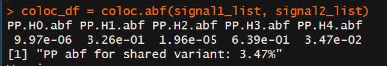
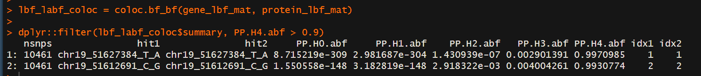

# Conditional-eQTL-meta-analysis
This Bioinformatics project tries to answer the question, "Is it possible to analyze eQTL data without the Suzie Method?" (Probably Wrong). Therefore the following 6 steps are necessary:

For steps 1-5 (Conditional eQTL analysis) we use the tool `tensorqtl`, wich is a python package. These steps were run on HPC.
For step 6 (Colocalisation) we used R tools.

Required data types:

1. Phenotypes: BED format
2. Genotypes: PLINK format
3. Covariates: a tab-delimited text file (covariates x samples) or dataframe (samples x covariates), with row and column headers

##
## Step 1: Perform normal eQTL analysis for SIGLEC14 gene, testing all common (MAF > 1%) variants in +/- 1Mb window around the promoter of the gene.

#### Normal eQTL analysis

A normal eQTL analysis typically involves testing for genetic variants that are associated with changes in gene expression levels (expression quantitative trait loci or eQTLs) across the genome, without any assumptions about the relationship between the genetic variant and the gene's location. So, no other variables are used.

The term "eQTL" stands for expression quantitative trait loci, and it refers to genetic variants (usually single nucleotide polymorphisms, or SNPs) that are associated with differences in gene expression levels.

### 1.1. Create phenotypes file.

tensorqtl requires phenotype data be in .bed or .bed.gz format. Phenotype file must contain #Chr, start, end, TargetID columns in the mentioned order.

To create such a file, we processed and merged normalised gene expression data and covariates data from different files: chromosome number, phenotype position (start, and end is start+1) were taken from one file, and TargetIds from another file.

### 1.2. TensorQTL analysis.

Tensorqtl provides 2 analyses: cis-eQTL analysis and trans-eQTL analysis.

cis-eQTL analysis is used to identify genetic variants that affect the expression level of genes located nearby (usually within 1 Mb distance from the transcription start site(TSS)).

So, __cis-eQTL analysis__ is the type of analysis we use in our project. Parameters used: maf_threshold=0.01, window=1000000. Besides, we run the analysis only for 19th chromosome as the gene is located there.

```python
eQTL_result_df = cis.map_cis(genotype_df, variant_df, phenotype_df.loc[phenotype_pos_df['chr']=='19'], phenotype_pos_df, maf_threshold=0.01, window=1000000)
```

##
## Step 2: Identify the most strongly associated variant (lead variant).

At first, we need to extract results for the SIGLEC14 gene:
```python
eQTL_SIGLEC14_df = eQTL_result_df[eQTL_result_df.index=='ENSG00000254415']
```

By default, only the lead variant is displayed after the tensorqtl cis mapping. This, after the first step we get the following dataframe with the lead variant (chr19_51627384_T_A).

phenotype_id | num_var | beta_shape1 | beta_shape2 | true_df | pval_true_df | variant_id | tss_distance | ma_samples | ma_count | af | pval_nominal | slope | slope_se | pval_perm | pval_beta |
--------------- | ----- | ------- | ---------- | ---------- | -------------- | ------------------ | ------ | --- | --- | -------- | -------------- | --------- | -------- | ------ | --------
ENSG00000254415 | 14863 | 1.03784 | 2284.05127 | 397.486603 | 4.515546e-09 | chr19_51627384_T_A | -19442 | 105 | 111 | 0.124719 | 5.973180e-10 | -0.615058 | 0.097147 | 0.0001 | 0.000007

##
## Step 3. Perform conditional eQTL analysis for SIGLEC14 by adding the lead variant as a covariate into the model.
## Step 4: Repeat this until no significant (p < 1e-5) associations remain.

For these steps, we need to create a covariant dataframe. Dataframe row indexes must be sample ids, and each column - variant id. The values are the genotype dosages (0, 1, or 2) for the variant in each individual (sample id).

```python
cov_df = genotype_df.loc[eQTL_SIGLEC14_df['variant_id']].T
```


Having such a dataframe, we run the same cis-mapping tensorqtl method with maf_threshold=0.01, window=1000000 parameters and also add the covariant dataframe as a parameter: covariates_df=cov_df.

```python
eQTL_result_df = cis.map_cis(genotype_df, variant_df, phenotype_df.loc[phenotype_pos_df['chr']=='19'],
                                     phenotype_pos_df, covariates_df=cov_df, maf_threshold=0.01, window=1000000)
```

After getting results, we repeat the process: we take the most strongly associated variant, add it to the covariants dataframe, run the conditional eQTL analysis. We stop when the p-value becomes >= 1e5 (that means that no significant associations remain).

```python
    while eQTL_SIGLEC14_df['pval_nominal'].iloc[0] < 1e-5:
        # Performing conditional eQTL analysis
        eQTL_result_df = cis.map_cis(genotype_df, variant_df, phenotype_df.loc[phenotype_pos_df['chr']=='19'],
                                     phenotype_pos_df, covariates_df=cov_df, maf_threshold=0.01, window=1000000)
        
        # Extracting results for the SIGLEC14 gene
        eQTL_SIGLEC14_df = eQTL_result_df[eQTL_result_df.index=='ENSG00000254415']

        # Extracting covariates and updating the covariates dataframe
        cov_df_temp = genotype_df.loc[eQTL_SIGLEC14_df['variant_id']].T
        cov_df = pd.merge(cov_df, cov_df_temp, left_index=True, right_index=True)
```

##
## Step 5: Identify all-but-one conditionally indepedent summary statistics.

In the previous steps we identified 3 variants with significant association (top 3 lead variants): chr19_51627384_T_A, chr19_51612691_C_G, chr19_50966950_G_GT.

In this step, conditioning (conditional eQTL analysis) has to be performed three times:
1. for Signal 1 condition on Signals 2 and 3 (add both lead SNPs as covariates).
2. for Signal 2, condition on Signals 1 and 3.
3. for Signal 3, condition on Signals 1 and 2.

, where signal 1 is chr19_51627384_T_A, signal 2 is chr19_51612691_C_G, and signal 3 is chr19_50966950_G_GT.

All-but-one conditional eQTL analysis is similar to that we used in the Step 3. The only difference is that we use different combinations of variants (1+2, 1+3, 2+3) as described above.

In addition, there is a difference of what we need to get in the result. In previous step we needed to identify a variant with the strongest association among all variants. Now, we need to know all variants despite the association significance.

cis_map function used in the Step 3 prints out only the lead variant, and there is no option to show all variants. Thus, in this step we have to utilize map_trans method. Since that it's behaviour is different, we were forced to perform extra work:

```
    # Extract 2 and 3 variants
    signals_2_3_df = covariants_df[['chr19_51612691_C_G', 'chr19_50966950_G_GT']]
    
    # Run trans eQTL mapping for the SIGLEC14 gene only
    # No p_val threshold to obtain results for all variants
    eQTL_result_df = trans.map_trans(genotype_df, phenotype_df.loc[phenotype_pos_df.index=='ENSG00000254415'],
                                     covariates_df=signals_2_3_df, pval_threshold=1, maf_threshold=0.01)
    
    # Extrant all non-cis regions for the SIGLEC14 gene
    trans_eQTL_result_df = trans.filter_cis(eQTL_result_df,
                                            phenotype_pos_df.loc[phenotype_pos_df.index=='ENSG00000254415'].T.to_dict(), 
                                            variant_df, window=1000000)
    
    # Remove all non-cis regions from the mapping result
    # to get only cis mappings for the SIGLEC14 gene
    merged_df = eQTL_result_df.merge(trans_eQTL_result_df, indicator=True, how='left')
    cis_result_df = merged_df[merged_df['_merge'] == 'left_only'].drop(columns='_merge')
    
```
At first, we perform trans eQTL analysis. At second, to remove non-cis associations, we identify them, and remove from the eQTL analysis result. As a result, we obtain a dataframe with the following structure (first variant from the code above):

variant_id | phenotype_id | pval | b | b_se | af |
--------------- | ----- | ------- | ---------- | ---------- | -------------- |
chr19_50646870_G_A | ENSG00000254415 | 0.824844196111419 | -0.01832097 | 0.08273168 | 0.16741572 |

In total, in this step we gain 3 dataframes with the structure above, each has 14863 elements. These dataframes are used in the colocalization in the Step 6.

##
## Step 6: Colocalisation

This step is done in R with help of the package "coloc". Here we trie to find out, if our data actually correlates and colocolized with the real data.
Therefore we did the following:

First we have to transform our each of our 3 dataframes (Further referred as signal 1 - 3) in a specific format, so that the colocalisation Methods can read them. After that we can run the colocalisation with the coloc.abf() Method on signal 1 and signal 2. This was done like this: 

```R
#Run coloc.abf

signal1_list = list(beta = signal1$b, 
                    
                    varbeta = signal1$b_se^2, 
                    
                    N = rep(445, length(signal1$b)), 
                    
                    MAF = pmin(signal1$af, 1-signal1$af), 
                    
                    snp = signal1$variant_id, 
                    
                    type = "quant")


coloc_df = coloc.abf(signal1_list, signal2_list)

labf_df = dplyr::transmute(coloc_df$results, variant = snp, labf_variable1 = lABF.df1, labf_variable2 = lABF.df2) %>% 
  
  dplyr::as_tibble()
```




To follow up we do another colocalisation between our results from the first colocalisation and the original Siglec14 data, to compare the LBFs from Siglec14 with the LABFs of our data:

```R
#Make protein lbf matrix

protein_lbf_mat = as.matrix(dplyr::select(siglec14_df, lbf_variable1:lbf_variable10))

row.names(protein_lbf_mat) = siglec14_df$variant

protein_lbf_mat = t(protein_lbf_mat)


#Make gene labf variable matrix

gene_lbf_mat = as.matrix(dplyr::select(labf_df, labf_variable1:labf_variable2))

row.names(gene_lbf_mat) = labf_df$variant

gene_lbf_mat = t(gene_lbf_mat)


#Perform colocalisation

lbf_labf_coloc = coloc.bf_bf(gene_lbf_mat, protein_lbf_mat)

dplyr::filter(lbf_labf_coloc$summary, PP.H4.abf > 0.9)
```



To further analyze this, we can do a scatterplot of ??? and ??? and see if they correlate. (Like on the nodes from the Ipad).

[PASTE PIC]


If we see in the end that the scatterplot from the colocalistation correlates (or was it something else?), then the project is a success and we showed this method of analysis works, so I can be then scaled up to be actually used instead of the suzie method? (Dont know the exact usage of this anymore)
##

##
## Conclusion
As we found out in this project, (...)
##
